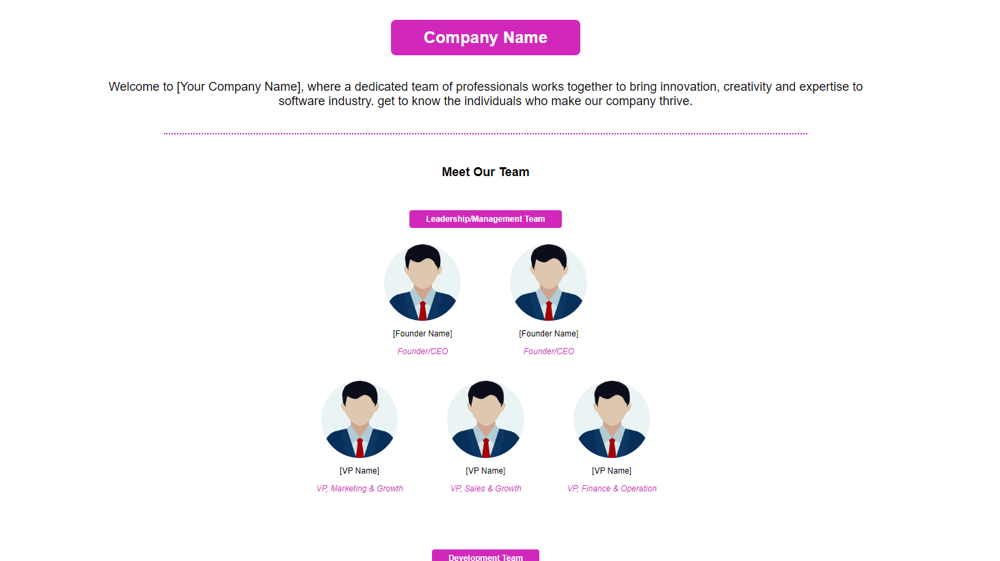

# Team Members Website

This is a website showcasing the team members of [Your Company Name]. It provides information about the leadership/management team, development team, and sales/marketing team.

## Table of Contents

- [Description](#description)
- [Demo](#demo)
- [Features](#features)
- [Usage](#usage)
- [Technologies Used](#technologies-used)
- [Contributing](#contributing)
- [License](#license)

## Description

This website is designed to introduce visitors to the team members of [Your Company Name]. It includes sections for the leadership/management team, development team, and sales/marketing team. Each team member is displayed with their name, role, and photo.

## Demo


<br/>

[Link to live demo](https://company-team-members-page.vercel.app/)

## Features

- Display team members with their name, role, and photo.
- Responsive design for optimal viewing on various devices.
- Easy navigation and clear layout.

## Usage

1. Clone the repository:

   ```bash
   git clone https://github.com/your-username/team-members-website.git
   ```

2. Open `index.html` in your web browser.

3. Explore the team members and their roles.

## Technologies Used

- HTML
- CSS
- [Add any additional technologies used]

## Contributing

Contributions are welcome! If you have any suggestions, enhancements, or bug fixes, feel free to open an issue or create a pull request.

## License

[Choose an appropriate license for your project. For example:]

This project is licensed under the [MIT License](LICENSE).

In this template:

- Replace `[Your Company Name]` with your actual company name.
- Update the placeholders with relevant information about your project.
- Add a live demo link once your website is deployed.
- Fill in the technologies used in your project.
- Choose an appropriate license and include the license file in your repository.
